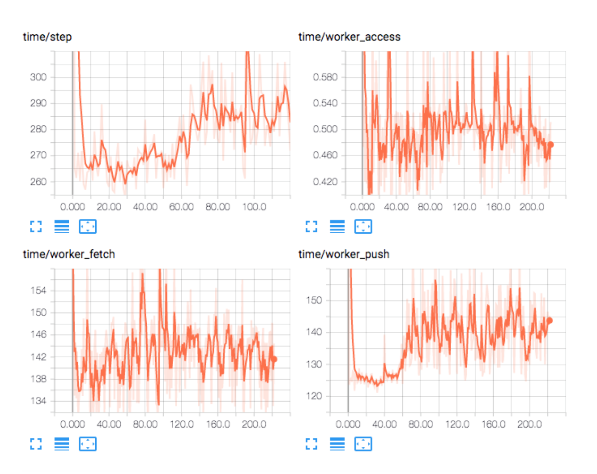

Parameter server benchmarks for TensorFlow and Ray

# Running Ray benchmark on AWS
```
git clone https://github.com/diux-dev/cluster.git
cd cluster/psbench
export AWS_ACCESS_KEY_ID=AKIAJZY.....5Y
export AWS_SECRET_ACCESS_KEY=HnKmxcnOvVBIUBiK....28Uu
export AWS_DEFAULT_REGION=us-west-2
# run one of the following
python launch_ray_adder.py --cluster=aws --zone=us-west-2a --instance=c5.large
python launch_ray_adder.py --cluster=aws --zone=us-west-2a --instance=c5.large --ps=4 --workers=1 --name=run2
python launch_ray_adder.py --cluster=aws --zone=us-west-2a --instance=c5.large --ps=1 --workers=4 --name=run3
```

# Running Ray benchmark locally
```
conda create --name cifar --clone my_favourite_env
source activate cifar
pip install portpicker
pip install tensorflow

git clone https://github.com/diux-dev/cluster.git
cd cluster/psbench
# run one of the following
python launch_ray_adder.py
python launch_ray_adder.py --workers=1 --ps=2
```


# Running TensorFlow benchmarks

```
python launch_tf_adder.py # runs locally with 1 parameter server, 1 worker
python launch_tf_adder.py --cluster=aws --zone=us-west-2a --instance=c5.18xlarge --ps=1 --workers=4 # runs on AWS with 1 parameter server, 4 workers
```

Running AWS command above will provide a link to TensorBoard and you would see something like this


