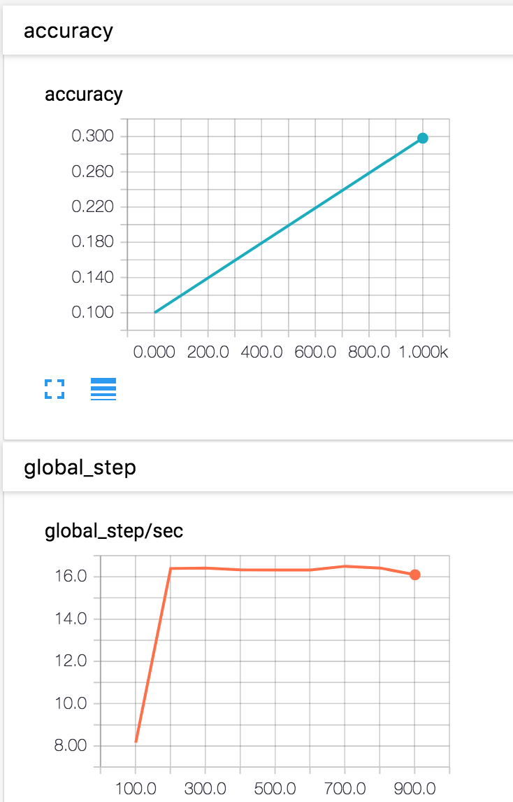
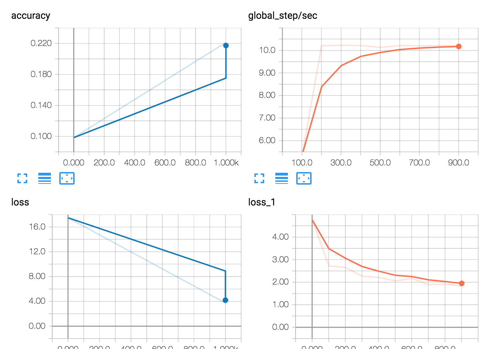
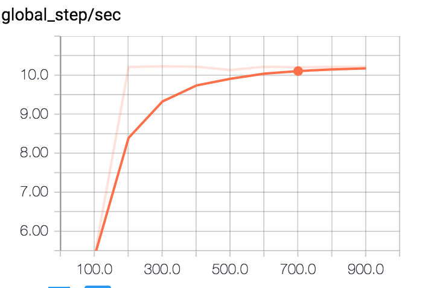

# CIFAR Estimator.

Run TensorFlow CIFAR10 Estimator example locally or on AWS.

Summary of experiments:
https://docs.google.com/document/d/1p4jtHZWj9lVoYswP94GhMEgOL93CsGFJTMdEzbLXGsI/edit#

Assumes that training/validation/eval data is in /efs/cifar-10-data (see Details)

# Launching

To launch locally:

```
pip install awscli boto3 paramiko pyyaml tzlocal portpicker
python launch.py
```

To launch on AWS:
```
pip install awscli boto3 paramiko pyyaml tzlocal portpicker
export AWS_DEFAULT_REGION=us-east-1
python launch.py --backend=aws --zone=us-east-1c
```

This will train for 1000 steps and launch TensorBoard so you can visualize the results. To connect to shell session which is running training do `tmux a -t cifar00` when running locally, or `connect cifar00` when running on AWS.

# Details
This assumes that data has been is stored under  `/efs/cifar-10-data`

More specifically, need the following files:
```
-rw-rw-r-- 1 ubuntu ubuntu  31260000 Jan 23 23:54 eval.tfrecords
-rw-rw-r-- 1 ubuntu ubuntu 125040000 Jan 23 23:54 train.tfrecords
-rw-rw-r-- 1 ubuntu ubuntu  31260000 Jan 23 23:54 validation.tfrecords
```

Those datafiles were generated following instructions from
https://github.com/tensorflow/models/tree/master/tutorials/image/cifar10_estimator

Note, those instructions must be followed under Python 2 environment.
```
source activate mxnet_p27
python generate_cifar10_tfrecords.py --data-dir=/tmp/cifar-10-data
cp -R /tmp/cifar-10-data /tmp
```

These files are also located in S3
```
https://s3.amazonaws.com/yaroslavvb/cifar-10-data/eval.tfrecords
https://s3.amazonaws.com/yaroslavvb/cifar-10-data/train.tfrecords
https://s3.amazonaws.com/yaroslavvb/cifar-10-data/validation.tfrecords
```

For sanity check can run estimator example locally

```
cd cifar10_estimator
source activate py2
python generate_cifar10_tfrecords.py --data-dir=/tmp/cifar-10-data

python cifar10_main.py --data-dir=/tmp/cifar-10-data \
                       --job-dir=/tmp/cifar10 \
                       --num-gpus=1 \
                       --train-steps=1000
```

On GTX1080 machine, this should finish in 1 minute, with final loss around 2.8549



On AWS g3 machine you should see something like this




